# Ansible Tower

### Project
---
* Set-up Project

### Credentials
---
* Openstack Authentication
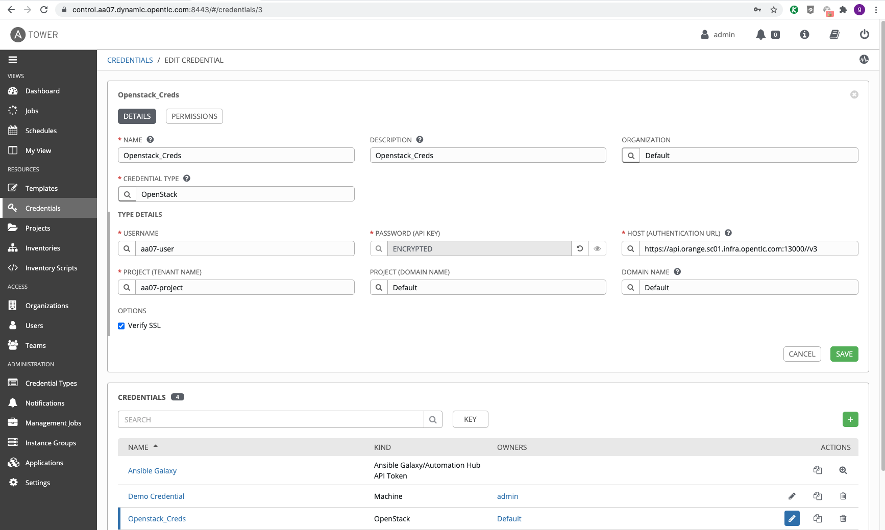
* SSH Authentication
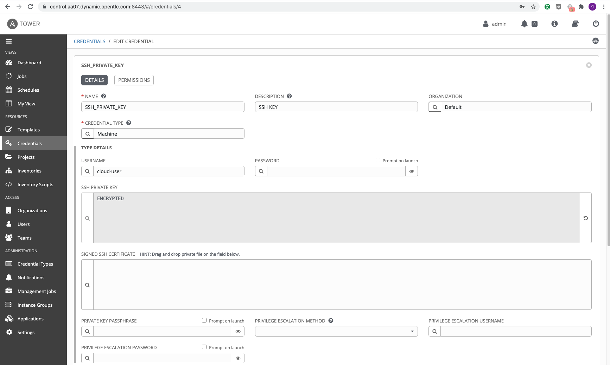

### Inventories
---
* Control Node Inventory
   > Use Control Node as a Host in order to provision

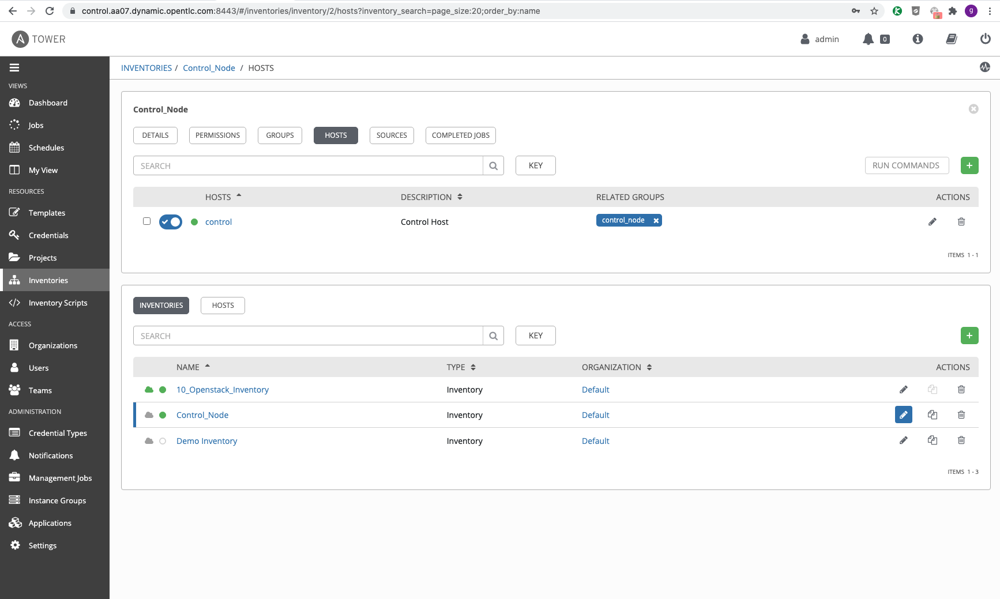

* Openstack Inventory
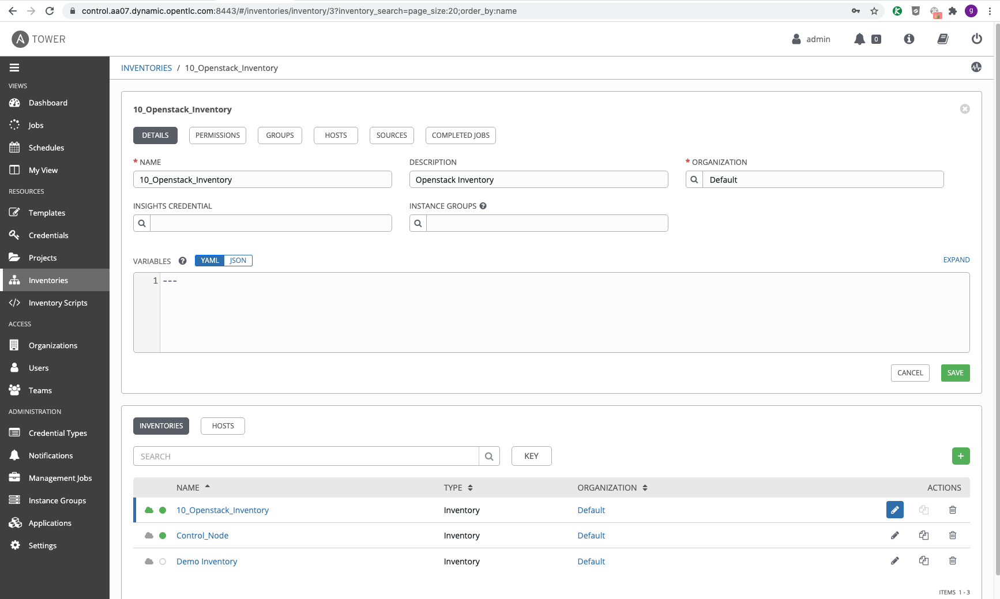
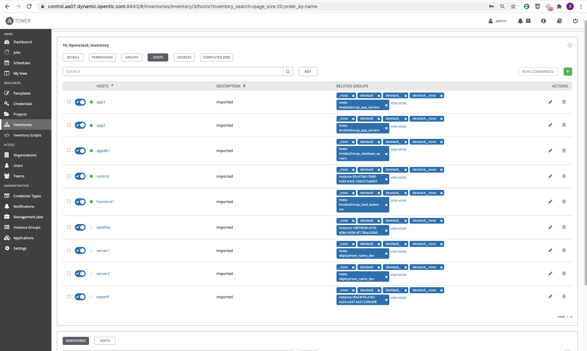

### Templates
---
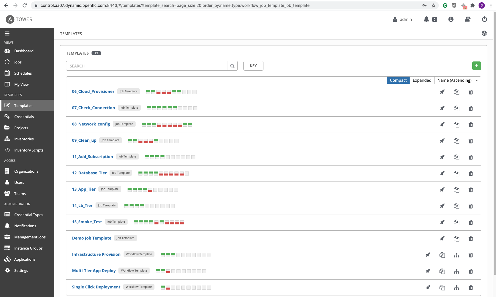
#### Infrastructure
* Provision Openstack Role

* Check Connection Role
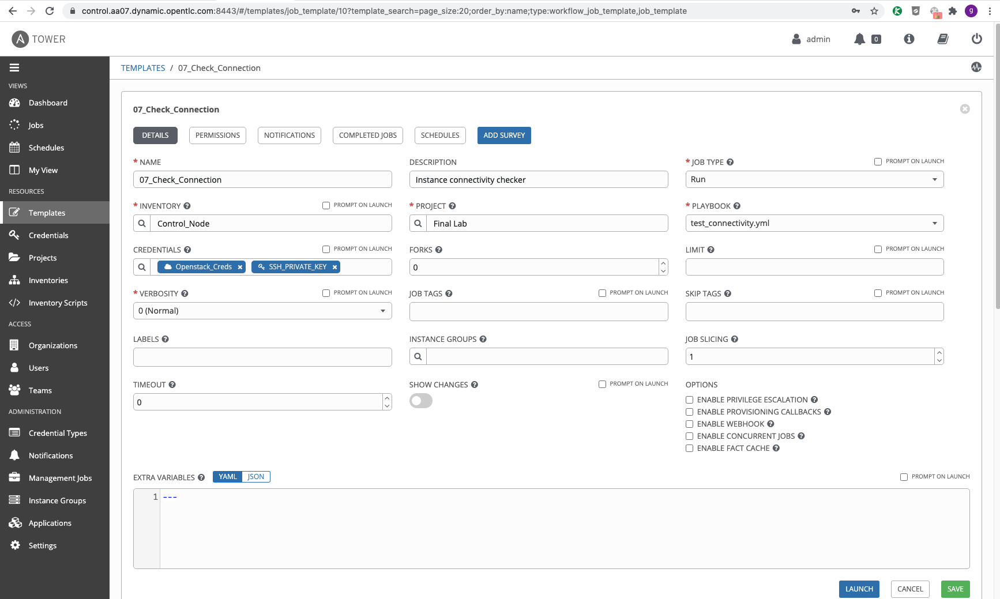

* Network Config Role
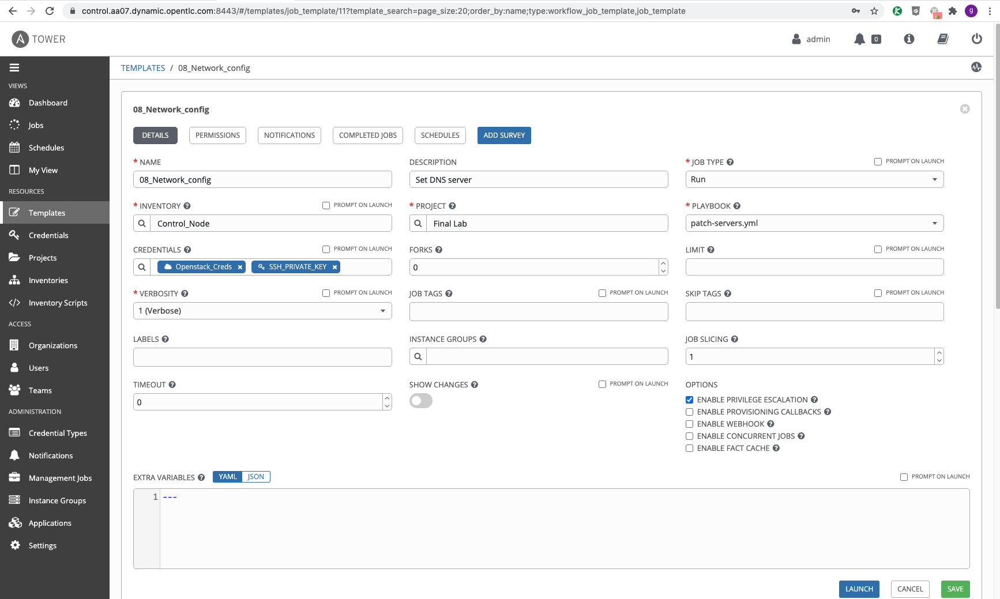

* Clean Up Role
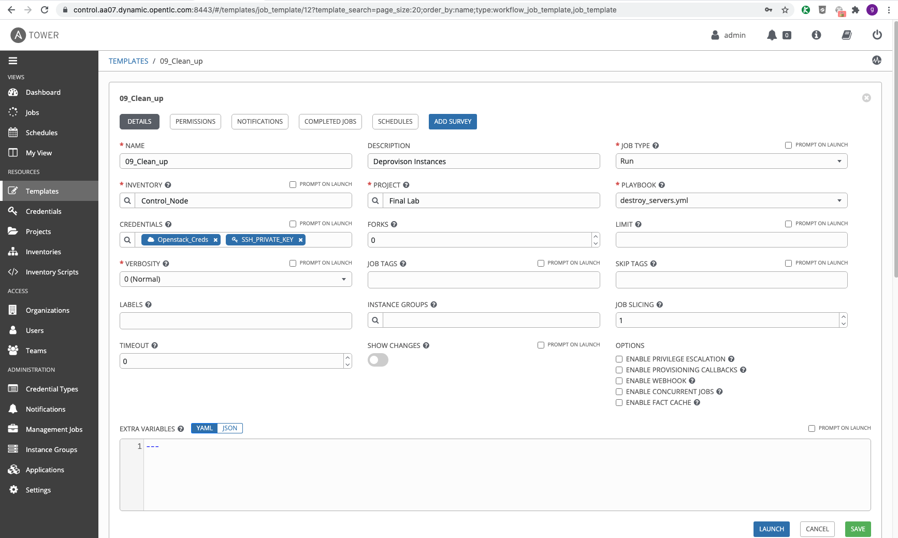

#### Multi-tier App
* Add Subscriptions Role
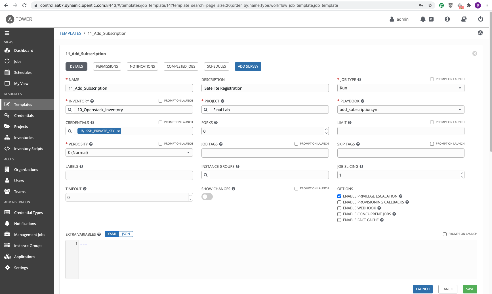

* Provision Postgresql Role

* Provision Flask Role 

* Provision HA-Proxy Role

* Smoke test Role
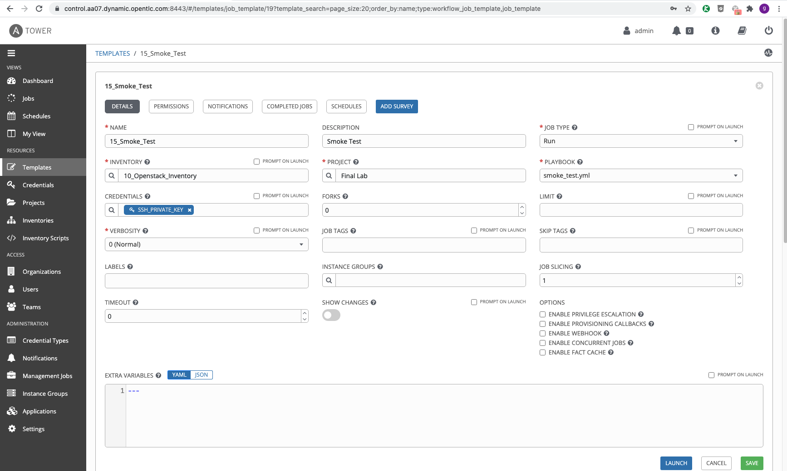

### Workflow
---
* Single Click Nested Workflow
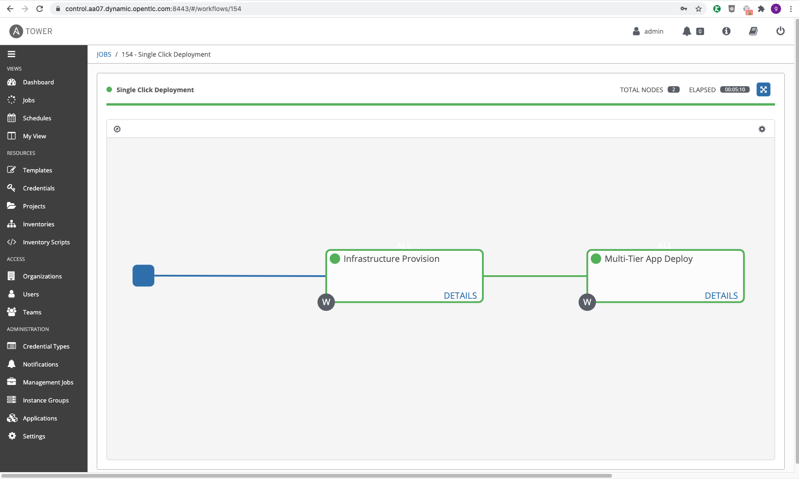
* Infrastructure Provision Workflow
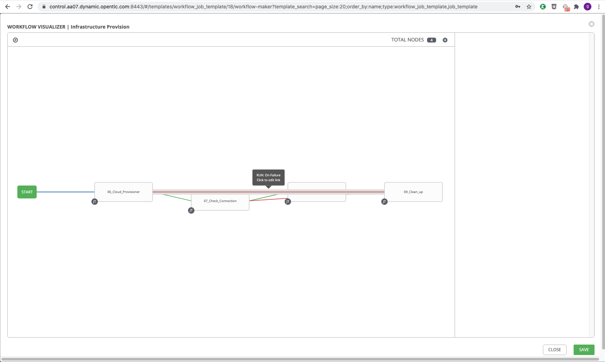
* Multi-Tier App Deploy Workflow
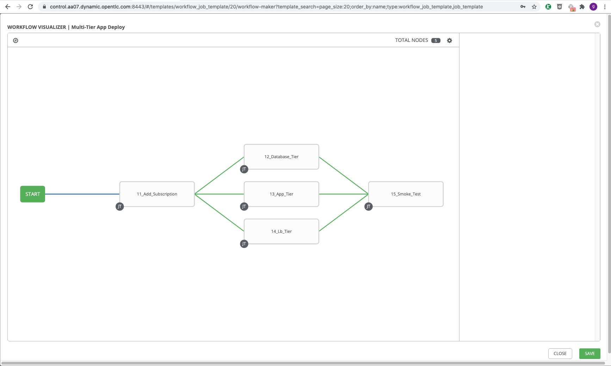